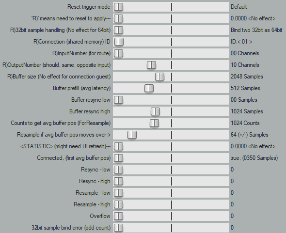

# What is RoutePePe?  
RoutePePe is VST®3 plugin that routes (connects, sends) audio stream between two DAW (Digital Audio Workstation), which can be running own separated audio interface!
VST® is a trademark of Steinberg Media Technologies GmbH, registered in Europe and other countries.




---

## Target platform
Microsoft Windows 10 (64bit), Digital Audio Workstation (64bit) that supports VST3.
I haven't tested but I assume RoutePePe can running other Windows versions too.

## What RoutePePe can do
**Route audio stream between two DAW, which can be running own separated audio interface, with same sample rate.**
* RoutePePe can make up to 100 connections, each connection can send/receive up to 64 audio stream channels.
* RoutePePe use shared memory method for connection. This can makes low-latency stable connections compared to network methods.
* RoutePePe can set buffer size and buffer position related with latency.
* RoutePePe can resync buffer position if there was some error, like delayed audio execution or audio sample missing, etc.
In other words RoutePePe can recover stable audio connection for audio sample dropout.
* RoutePePe can handle clock drift effect. (Because clock of two separated audio interface is different)
  * This is because RoutePePe can monitor average buffer position which is slowly moving as time goes, and do resample.
  * Resample of RoutePePe is very simple, RoutePePe just insert/remove one audio sample.
But don't worry, you can control how much movement of average buffer position cause resample.
And there is no resample until average buffer position moves over that value (this is usually long time).
After all if the two clock are really similar than audio is barely distorted.
If you really mind about this, just sync two audio interface clock manually.
  * You can disable this behavior, than RoutePePe just resync buffer position after long time.
This cause large audio distortion at that moment.
* RoutePePe has statistic. You can check errors like resync, resample, overflow, or etc.
If there was no error at all, this means that RoutePePe successfully send/receive audio stream (sample-accurate).
* RoutePePe supports both 32bit float sample and 64bit float sample.
* Route audio stream in one DAW. (It is possible actually)

## What RoutePePe can't do
* **Connect two DAW which are running on different sample rate.**
* Connect two DAW which are running on separated PC. Connect two DAW over network.
* Route MIDI signal.
(There are some good other loopback MIDI driver. I don't feel need to implement this, unless enough people request it)
* Synchronize two DAW timecode (like playback position) and compensate delay.

---

## How to use
> ### Download
> * Get RoutePePe release binary from release section of github RoutePePe repository.  
[RoutePePe release](https://github.com/Lumy0726/RoutePePe/releases/)  
Or you can build RoutePePe yourself if you want.
> * Upzip it somewhere you want.
> * Add it's path to VST path setting of you DAW, or just copy binary into existing VST path.
Of course you need to rescan VST on your DAW.
> 
> ### Connection
> * Insert RoutePePe plugin and set "R)Connection (shared memory) ID".
> * Reset first RoutePePe.
There are several ways to do this depending on DAW, like set offline/online state of plugin.
One good method is save/load preset.
If memory creation was successful, then "Resync - (low, high)" or "Overflow" statistic would be increasing (only "low" value but not "high").
Note that some(most?) DAW might needs UI refresh to check statistic value.
> * Insert second RoutePePe plugin and set same "R)Connection (shared memory) ID".
> * Reset second RoutePePe.
> * That's it!
Statistic will be reset at the first connection,
and "Connected, (first resample avg buffer pos)" value shows "true, ...",
if everythings goes well.
> 
> ### Caution
> * **You should need to set "R)32bit sample handling (No effect for 64bit)" option to "Convert to 64bit",
> if two DAW are running on 32bit/64bit float sample respectively.**
> More details on "Settings detail" section.
> * **If you are trying to reset both RoutePePe simultaneously, RoutePePe can't make connection.**
Setting same ID of two RoutePePe on one DAW and launching that DAW will not work, for example.
> * **There are host-guest relationship of two RoutePePe.**
**After connection, resetting guest is fine but resetting host makes connection problem (host can't re-open shared memory).**
For this you have to disable both host and guest and do connection again.
> * **Don't try to connect more than two RoutePePe with same connection ID.**
If that is the case,
one/two RoutePePe will read/write audio sample,
which make speed of reading or writing to double (merge or divide audio samples).
This makes no sense.
> * **You might need to run two DAW with same privilege.**
For example, launch both DAW with/without administrator privilege with same account.
If not RoutePePe might fail to open shared memory.
> 
> ### Settings detail
> 
> Note that 'R)' options need RoutePePe reset in order to take effect.
> * Reset trigger mode
> > Decide when to reset RoutePePe.
Recommended "Default" if you don't have specific reason.
If you set it to "Often" then RoutePePe will be reset on more event depending on DAW, like playback start/stop.
Technically "Often" option cause reset on every "Steinberg::Vst::AudioEffect::setActive()" call.
> * R)32bit sample handling (No effect for 64bit)
> > If you set it to "Bind two 32bit as 64bit", RoutePePe will send/receive 32bit audio stream without conversion.
But this might cause sample dropout if in/out count of sample is odd (because audio buffer of RoutePePe is actually 64bit).
I assume this odd count is not the case of most DAW, but if this is the case you can check statistic value.
In this mode you can't connect two DAW that is running on 32bit/64bit float sample respectively.
If you set it to "Convert to 64bit", RoutePePe will convert 32bit float audio sample to 64bit.
This option has no effect if the RoutePePe is running on 64bit float sample mode.
You might able to find option in the DAW to decide 32bit/64bit for VST plugin.
If you don't know RoutePePe is running on 32bit mode or 64bit mode,
you can set "Buffer size" and "Buffer resync high" to 32768 and "Buffer prefill" to 16384,
and check latency of "Bind two 32bit as 64bit" and "Convert to 64bit" options respectively.
If RoutePePe is running on 32bit and option is "Bind two 32bit as 64bit", latency will be double.
> * R)Connection (shared memory) ID
> > Set ID of connection (shared memory).
If you set it "NO CONNECTION ID", RoutePePe make no connection.
You can use this option when you want to disable connection after reset.
> * R)InputNumber (for route)
> > Input channel number, to send audio to opposite RoutePePe.
You can set it to 0 to disable input.
Note that this option does not restrict input channel of VST plugin, you can set it in your DAW.
> * R)OutputNumber (should, same, opposite input)
> > Output channel number, to receive audio from opposite RoutePePe.
You can set it to 0 to disable output.
Note that this value should be same with opposite RoutePePe InputNumber.
If not RoutePePe might fail to make connection,
or increase "Overflow" and/or "Resync - low" statistic value for unconnected channels.
Note that this option does not restrict input channel of VST plugin, you can set it in your DAW.
> * R)Buffer size (No effect for connection guest)
> > Buffer size, of shared memory.
You can set it enough because this value does not directly decide latency.
But setting two high value is not recommended,
such setting wastes your memory and even lower performance of RoutePePe (lower memory locality).
Also note that this value has no effect on connection guest.
RoutePePe doesn't inform connection guest mode or opposite's buffer size.
Therefore it is recommended to set same buffer size with opposite's buffer size.
> * Buffer prefill (avg latency)
> > This decides how much RoutePePe fill audio buffer to zero-sample when connection started.
And decides how much RoutePePe fill/remove audio buffer (to zero-sample) at resync.
This value actually decides latency, but actually latency can be slightly different.
Note that actual maximum value of this setting is "Buffer size".
And RoutePePe doesn't inform that actual value is changed to "Buffer size", so please be careful.
Setting this value does not require reset,
therefore you can change latency while connection is on by changing this and "Buffer resync" options.
Of course such behavior cause resync (audio dropout) at that moment.
> * Buffer resync low
> > If buffer position goes below this, RoutePePe will do resync.
You can just leave it as 0.
For this case RoutePePe will do resync when there is no enough audio sample to read.
> * Buffer resync high
> > If buffer position goes above this, RoutePePe will do resync.
Recommended to set double of "Buffer prefill".
Note that of course actual maximum value of this setting is "Buffer size".
(Technically actual buffer size is "buffer size + 1",
and write side just make overflow when there is no enough empty buffer to write,
and read side can detect buffer position is greater than "Buffer resync high",
even if "Buffer size" and "Buffer resync high" is same).
> * Counts to get avg buffer pos (ForResync)
> > Counts to get average buffer position, for resync.
RoutePePe fills/inserts/removes audio sample when connection starts or do resync,
to match buffer position to "Buffer prefill (avg latency)" value.
If this option is not "Direct prefill",
then RoutePePe first calculates average buffer position and inserts/removes audio samples using difference between average buffer position and prefill value.
This helps actual latency would be more similar with "Buffer prefill (avg latency)" value.
Audio will be muted until RoutePePe complete resync,
so it is not recommended to set too high value,
which cause large startup/resync delay (not audio latency).
> * Counts to get avg buffer pos (ForResample)
> > Counts to get average buffer position, for resample.
You can set it to 0 to disable resample.
RoutePePe will check buffer position every time when reading buffer,
and calculate/check average buffer position based on this setting value.
> * Resample if avg buffer pos moves over->
> > If average buffer position moves (goes down or goes up) over than this value,
RoutePePe will do resample (insert/remove) one audio sample per audio stream block,
to move average buffer position back.
If this value is 0, always resample when average buffer position moves (not recommended).
If "Counts to get avg buffer pos (ForResample)" options is 0, this option has no effect.
> 
> ### Statistic values detail
> 
> Note that some(most?) DAW need to refresh UI to check statistic value.\
Like opening UI again, or setting automation of RoutePePe parameter, etc.
Statistic values are not saved on preset.
You can just touch statistic parameter to reset statistic value.
> * Connected, (first resample avg buffer pos)
> > This shows status of RoutePePe.
If connection is on, this value will be true.
For disconnection this value is not changed (but "Resync - low" and/or "Overflow" statistic will be increased).
This also shows first resample average buffer position,
which is actually decides latency,
but actual latency can be slightly different than this value too.
This first resample average buffer position is only one-time updated after the first connection or after the resync, and after some time to calculate average buffer position.
Note that first resample average buffer position is only displayed if RoutePePe has output channels and resample is enabled.
RoutePePe can say that average buffer position is "a - r <= avgerage buffer position <= a + r",
if resample is enabled,
('a' is the first resample average buffer position, 'r' is "Resample if avg buffer pos moves over->" value).
You can not connect/disconnect or control latency with changing this value..
> * Resync - (low, high)
> > Counts of resync because buffer position is low or high.
Only calculated when this RoutePePe has output channel.
> * Resample - (low, high)
> > Counts of resample because average buffer position is low or high.
This is equal with inserted/removed audio sample counts.
Only calculated when this RoutePePe has output channel.
> * Overflow
> > Counts of overflow, there is no enough empty buffer to write.
Only calculated when this RoutePePe has input channel.
> * 32bit sample bind error (odd count)
> > Counts of 32bit sample handling error.
Because "R)32bit sample handling (No effect for 64bit)" option is "Bind two 32bit as 64bit",
and RoutePePe VST3 is running on 32bit float sample mode,
and input/output audio stream count is odd.
If you see this value, than you should set
"R)32bit sample handling (No effect for 64bit)" option to "Convert to 64bit".

---

## How to build manually
You need Microsoft Visual Studio and CMake.  
1. Download source code (or "git clone" etc).
2. Download Steinberg VST SDK.
You can download it from offcial website or from google drive:
[VST SDK](https://drive.google.com/file/d/18xqMjgHY_G8FRqYXZG3HOgQuEbYtzSQE/view?usp=sharing)
Also Unzip that somewhere.
3. Open "CMakeList.txt" of project root directory and set your path of VST SDK.
Inside that SDK directory, there are "base", "bin", "public.sdk", etc (This is just for reference).
At the "CMakeList.txt" line 4, you can see this.
```
set(vst3sdk_SOURCE_DIR vst3sdk)
```
Change this something like this.
```
set(vst3sdk_SOURCE_DIR C:/Your_SDK_PATH/vst3sdk)
```
4. Make directory named "build" inside of project root directory.
5. Open CMake GUI and set source code location and binaries build location (project root directory, "build" directory respectively).
6. Press "Configure" button and select your Visual Studio.
7. Setting CMake options. Some options are only visible when "Advanced" option is checked.
> * Uncheck "SMTG_ADD_VST3_PLUGINS_SAMPLES".
> * Uncheck "SMTG_ADD_VSTGUI".
> * Uncheck "SMTG_CREATE_PLUGIN_LINK".
> * Uncheck "SMTG_RUN_VST_VALIDATOR".
If you uncheck this build might fail at the last step (on release mode? I don't know reason).
But actual VST3 file exists and you can use it.
> * Uncheck "VSTGUI_ENABLE_DEPRECATED_METHODS".
> * Uncheck "VSTGUI_ENABLE_OPENGL_SUPPORT".
> * Uncheck "VSTGUI_ENABLE_XMLPARSER".
> * If you want to use static CRT,
check "SMTG_USE_STATIC_CRT" and change "/MD" to "/MT" of values something like this->("CMAKE_C_FLAGS~", "CMAKE_CXX_FLAGS~").
> * If you want to build release version, change "debug" to "release" of value "CMAKE_BUILD_TYPE".
8. Press "Generate" and "Open Project".
9. Open the solution explorer in the Visual Studio and right click "RoutePePe" project and build.
Before that you might need to change solution type to "release" if you want release build.
10. If build was successful, VST3 file will be at "build\VST3\Release\RoutePePe.vst3\Contents\x86_64-win\RoutePePe.vst3".
